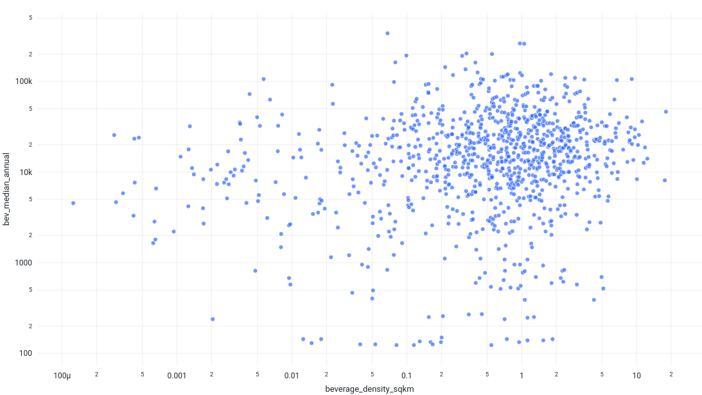

# Feature Development Challenge

**Online Rexburg Team**

### The Code
[Link to Databricks notebook.]()

## Austin's Feature:

### Description

### Wrangling the Data

### The Code
[Link to Databricks notebook.]()

## Michelle's Feature: The Average Repeat Visitation Per Tract Code

### Description

This feature aims to estimate the average percentage of visitors who have made repeat visits to beverage-related establishments (NAICS Code 722515 Snack and Nonalcoholic Beverage Bars) within a specified timeframe. Calculating this metric can provide insights into customer loyalty and engagement, which can be valuable for targeted strategies aimed at retaining and attracting repeat customers.

### The Code
[Link to Databricks notebook.](https://dbc-d55ab3ee-ad9a.cloud.databricks.com/?o=1721200461604912#notebook/3014236572135529/command/3014236572135530)

## Keaton's Feature: 

### Description
The simple feature is a ratio of water area to total land area (including water) per census tract. This may be helpful in finding water features or waterfront locations, but doesn't seem to correlate with median yearly traffic. I'm not sure if the effects of water cancel out over season changes. It may be better to go for more of a latitude-based approach.

The comparison to the target isn't great, but there is a grouping around 10% water area, which could be due entirely to population.

The complex feature measures shop density per 100 sqkm per census tract. In this case, it's the beverage NAICS code, but can easily be extended to include other codes. This metric is a good companion measure to population density to show where shop density is lagging behind population demand.

This histogram is a sanity check to make sure that the number of higher density shop locations decreases exponentially, like we'd expect.

Again, this fit isn't obvious, but has a grouping that shifts for different NAICS codes that the ML model could pick up on.

### The Code
[Link to Databricks notebook.](ComplexFeatureChallenge.ipynb)

